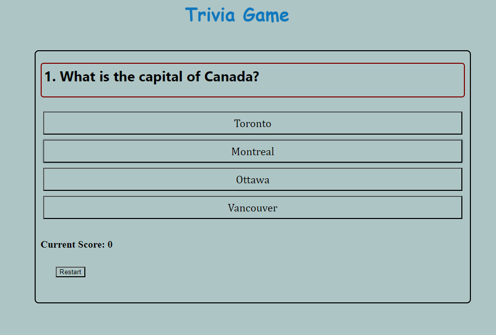

## Name of Game is - Trivia Game 

This Trivia Game is simple web application that allows user to check thier knowledge and take a test. There are four option with each set of question . When user select the right answer the score count goes up. After completing the quiz , the user will see their score, indicating how many question player answered correctly. 

## ScreenShots

## Technolgies used

HTML -Provides the basic Structure of the web page.

CSS- Add styles and layout for better design and user experience.

JavaScript-Implements functionality and interactivity of the quiz.

## Getting Started

1. By clicking the Link below app will open in a new window.
2. The app will display mutiple questions with four different answer.
3. Click the answer which you believe is correct.
4. It will take to you next question and increase one score if the answer is right.
5. It allows user to restart the game if wanted.
6. When the quiz is finished it display the number of answers guessed right.

## LINK

https://harkirats043.github.io/Trivia-Game/
 
 
## Sources 
1. CSS - MDN is referred for styling and layout used in quiz.
2. JavaScript MDN is used as reference for features and functions.